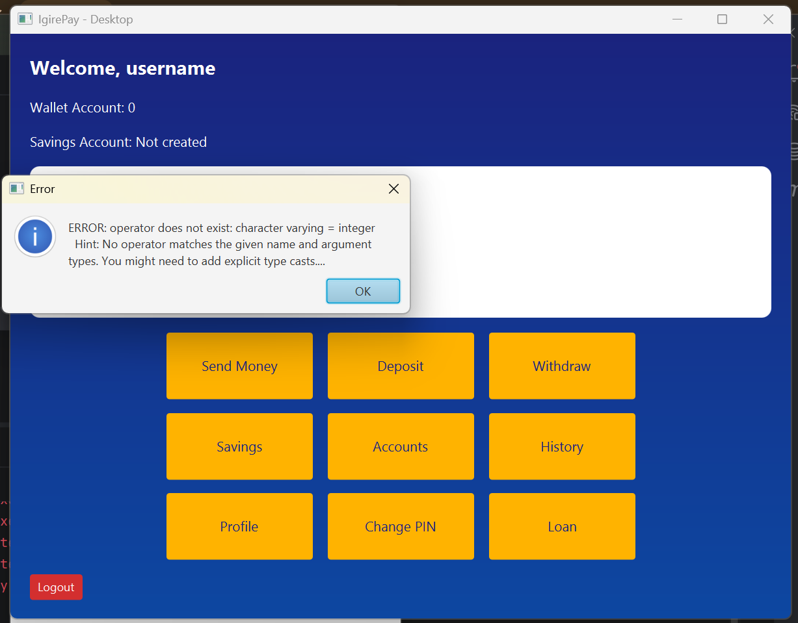

# Phase-One-Capstone-Project
##was containing 3Labs 
 LAB1: that shows oop concept designs in action
 LAB2: that shows  database integration with jdbc
 LAB3: that shows  javafx this phases it combine those both labs 
       then shows UI of our apps 

##here there is technology we use to design our igirepay- Desktop
AI that technology was helping me to understand my capstone-project as and was guided me 
in building of it  by using #IntelliJ ideal(project structure)
#postgresql(connectivity of database)

 

this screen shoot show how my dashboard look like

